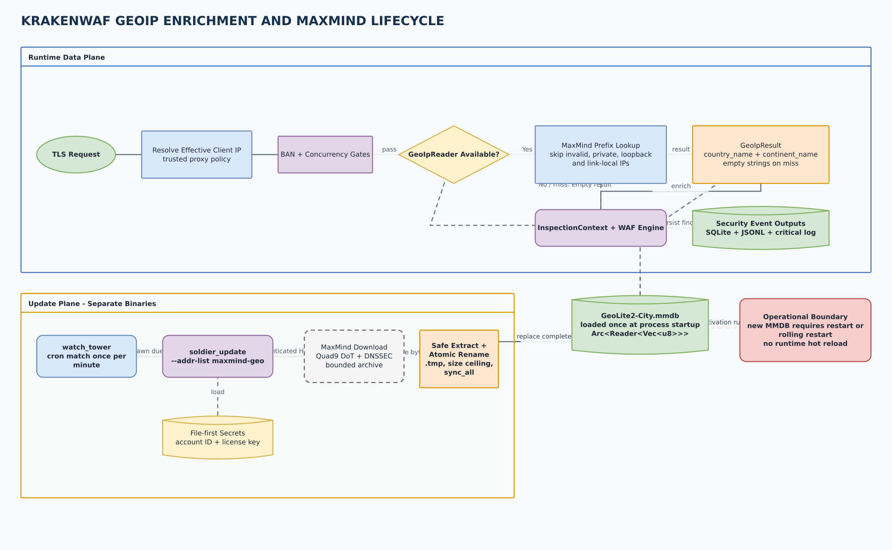
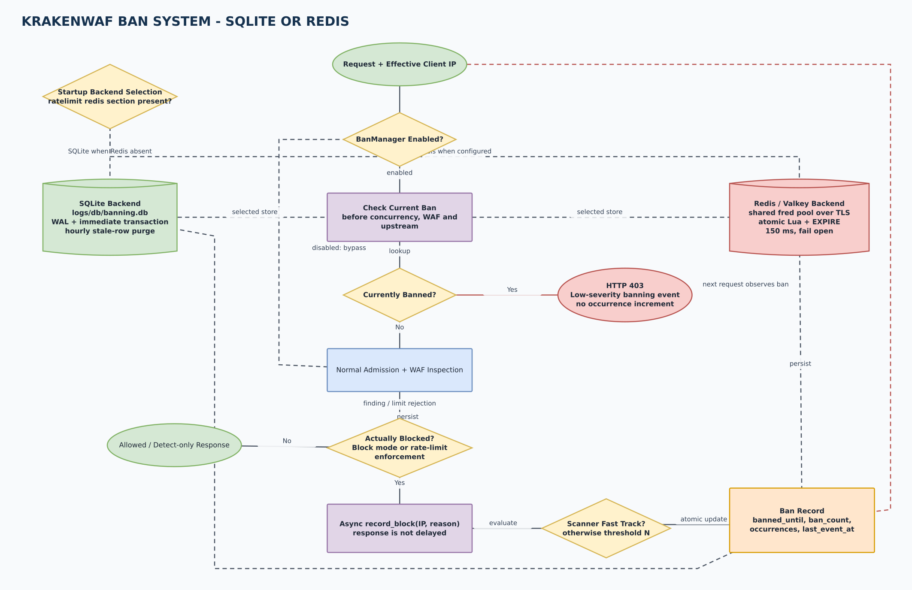
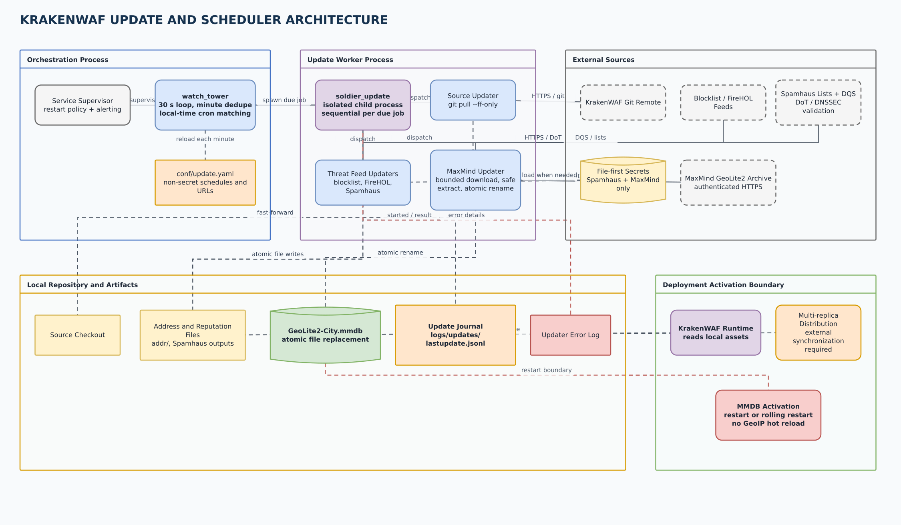
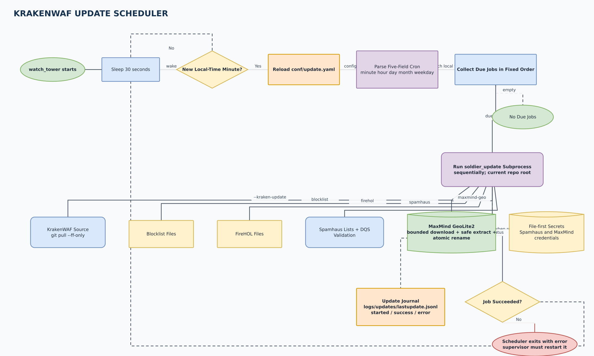

# KrakenWAF visual architecture

These diagrams describe the runtime architecture at commit `a0a9679`.
All labels are in English and the source is editable in draw.io.

> The algorithm implemented by KrakenWAF is **GCRA** (Generic Cell Rate
> Algorithm). The occasionally used spelling "GRCA" refers to the same feature,
> but GCRA is the canonical term used by the code and this documentation.

## Diagram set

| View | Purpose | Preview | Editable source |
| --- | --- | --- | --- |
| Local architecture | Single-node deployment with local GCRA and SQLite WAL or Postcard snapshots | [PNG](diagrams/krakenwaf-local-architecture.png) | [draw.io](diagrams/krakenwaf-local-architecture.drawio) |
| Redis architecture | Multi-replica deployment with distributed GCRA and shared banning state | [PNG](diagrams/krakenwaf-redis-architecture.png) | [draw.io](diagrams/krakenwaf-redis-architecture.drawio) |
| Request processing | Data-plane admission, inspection, forwarding, and blocking flow | [PNG](diagrams/krakenwaf-request-flow.png) | [draw.io](diagrams/krakenwaf-request-flow.drawio) |
| GCRA admission | Local and Redis admission decisions, including backend failure policy | [PNG](diagrams/krakenwaf-gcra-flow.png) | [draw.io](diagrams/krakenwaf-gcra-flow.drawio) |
| Rule management | Allowlist and Rorschach gates, CMC updates, atomic rule replacement, and rollback | [PNG](diagrams/krakenwaf-rule-management-flow.png) | [draw.io](diagrams/krakenwaf-rule-management-flow.drawio) |
| Metrics and health | Runtime collection, observability access gates, GCRA, Prometheus rendering, and probe exemptions | [PNG](diagrams/krakenwaf-metrics-flow.png) | [draw.io](diagrams/krakenwaf-metrics-flow.drawio) |
| GeoIP and MaxMind | Runtime enrichment, local MMDB lookup, scheduled download, atomic replacement, and restart boundary | [PNG](diagrams/krakenwaf-geoip-architecture.png) | [draw.io](diagrams/krakenwaf-geoip-architecture.drawio) |
| BAN system | Request short-circuit, asynchronous block accounting, SQLite/Redis selection, retention, and failure behavior | [PNG](diagrams/krakenwaf-ban-system.png) | [draw.io](diagrams/krakenwaf-ban-system.drawio) |
| Update architecture | `watch_tower`, isolated update workers, external sources, local artifacts, journaling, and deployment activation | [PNG](diagrams/krakenwaf-update-scheduler-architecture.png) | [draw.io](diagrams/krakenwaf-update-scheduler-architecture.drawio) |
| Update scheduler | Minute deduplication, cron matching, sequential `soldier_update` jobs, output files, and failure semantics | [PNG](diagrams/krakenwaf-scheduler-flow.png) | [draw.io](diagrams/krakenwaf-scheduler-flow.drawio) |

## Local GCRA with SQLite or Postcard

The data plane resolves the effective client IP, checks the optional ban list,
enforces per-IP concurrency, and then applies GCRA before signature inspection.
The local limiter keeps TAT values in 64 in-process shards and persists a
snapshot every 60 seconds. `--wal-mode sqlite` writes an inspectable SQLite WAL
database; `--wal-mode postcard` writes an atomic-rename binary snapshot. These
formats persist only rate-limit state. Security findings always use
`logs/db/vulns_alert.db`, and local banning uses `logs/db/banning.db` when
enabled.

GeoIP is a local, read-only runtime dependency. `GeoLite2-City.mmdb` is opened
once at startup and shared through an `Arc`; it is not queried over the network
for each request. The local BAN backend is a separate SQLite WAL database with
an immediate transaction for block accounting and an hourly stale-row purge.
`watch_tower` and `soldier_update` are separate binaries, not background tasks
inside the data-plane process.

## Distributed GCRA with Redis

When `conf/ratelimit.yaml` contains `redis:`, every replica uses an atomic Lua
script and Redis `TIME` to share GCRA TAT state without application-host clock
skew. The same TLS connection pool is reused by the banning subsystem. Redis
does **not** replace the per-node vulnerability database, rule files, or metrics
registry. Rule-management updates are local to the replica receiving the
request; production clusters must distribute managed rule files consistently.

Redis transport must use `rediss://`. Credentials are resolved file-first and
then from environment variables. If Redis is unavailable, `redis.fail_open`
selects allow or deny behavior; both paths emit warnings and dedicated
Prometheus counters.

The Redis pool is also reused by `RedisBanStore`, whose lookup and record
operations have a 150 ms budget and fail open. Redis shares only rate-limit and
BAN state. GeoIP readers, MMDB files, managed rules, metrics registries, and
vulnerability databases remain replica-local and need an external distribution
and restart strategy.

## Runtime flows

GCRA applies to all proxied requests before the allow-path decision. An
allow-listed path skips signature inspection but still consumes the shared
per-IP request budget. `/metrics` on the observability listener is also
rate-limited; health probes are exempt.

Both backends implement the same typed allow/deny contract and return an exact
retry delay. Local capacity exhaustion denies admission. Redis unavailability
uses the configured fail-open or fail-closed policy rather than silently
falling back to local state.

The control plane binds separately on port `4342` and is enabled only when both
Rorschach secrets are valid. The IP allowlist is checked before authentication.
CMC flags are hot-swapped in memory. Managed regex, keyword, and scanner files
are validated, staged, atomically renamed, and then reloaded into one live
engine snapshot; a reload failure restores the previous bytes and reloads them.

Runtime requests, blocks, rate-limit outcomes, trace propagation, latency, and
per-module findings update the in-memory metrics registry. On the dedicated
observability listener, IP restrictions run before bearer authentication.
`/metrics` then shares the data-plane GCRA budget and renders Prometheus text;
liveness and readiness probes are intentionally exempt from GCRA so orchestration
checks cannot be throttled.

## GeoIP and MaxMind lifecycle

After trusted-proxy resolution and the early BAN/concurrency gates, the proxy
performs one local MaxMind prefix lookup and adds `country_name` and
`continent_name` to `InspectionContext`. Invalid, private, loopback, link-local,
missing, and undecodable entries produce empty fields without failing the
request. Findings carry those fields into SQLite, JSONL, and the critical log.

The update path is isolated from request processing. `soldier_update` loads
file-first MaxMind credentials, downloads through the hardened updater client,
enforces archive and extracted-file ceilings, writes a temporary file, calls
`sync_all`, and atomically renames it over the final MMDB. The running reader
does not hot-reload; activate new data with a restart or rolling restart. See
[geoip.md](geoip.md).

## BAN system

`BanManager` is inert when banning is disabled. Otherwise it checks the
effective IP before concurrency, WAF inspection, and upstream forwarding. A
current ban returns HTTP 403 and does not increment the offender counters.
Enforced WAF and rate-limit blocks call `record_block` asynchronously, so a new
ban affects the next request rather than delaying the current response.

At startup, the presence of the rate-limiter Redis configuration selects a
shared `RedisBanStore`; otherwise `SqliteBanStore` opens
`logs/db/banning.db`. Both track `banned_until`, `ban_count`, `occurrences`, and
`last_event_at`, and both implement scanner fast-track plus progressive ban
duration. Redis uses atomic Lua and key expiry; SQLite uses an immediate
transaction and explicit hourly retention cleanup. See [banning.md](banning.md).

## Update scheduler

The update architecture separates service supervision, cron orchestration,
isolated update workers, external data sources, local artifacts, and runtime
activation. `watch_tower` never downloads or writes assets itself; it launches
the sibling `soldier_update` binary with a specific action. The worker owns
network hardening, secret loading, validation, atomic file replacement, and
update journaling.

`watch_tower` wakes every 30 seconds but evaluates a local-time minute only
once. On each new minute it reloads `conf/update.yaml`, parses the supported
five-field cron expressions, and executes due `soldier_update` subprocesses
sequentially in fixed order: source checkout, blocklist, FireHOL, Spamhaus, and
MaxMind. Every action journals start/success/error records to
`logs/updates/lastupdate.jsonl`. A malformed cron, configuration failure, or
failed child process terminates the scheduler, so production deployments need
a service supervisor with restart policy. See [scheduler.md](scheduler.md).

## Operational surfaces

| Surface | Default | Protection | Main responsibility |
| --- | --- | --- | --- |
| Data plane | `:443` | TLS, trusted-proxy policy, WAF admission controls | Reverse proxy, request/response inspection, WebSocket policy |
| Rule management | `:4342` | CIDR allowlist, rotating body-bound Rorschach token | CMC toggles and managed rule-file replacement |
| Observability | `:4343` | IP allowlist and/or bearer token | Prometheus `/metrics`, liveness, readiness, health |

Prometheus output includes inspected and blocked totals, rate-limit hits,
per-engine/module block labels, request latency, trace-context counters, and
Redis fail-open/fail-closed counters. See [observability.md](observability.md),
[rate_limit.md](rate_limit.md), [rule_management.md](rule_management.md),
[banning.md](banning.md), [geoip.md](geoip.md), and [scheduler.md](scheduler.md)
for the full operational contracts.
