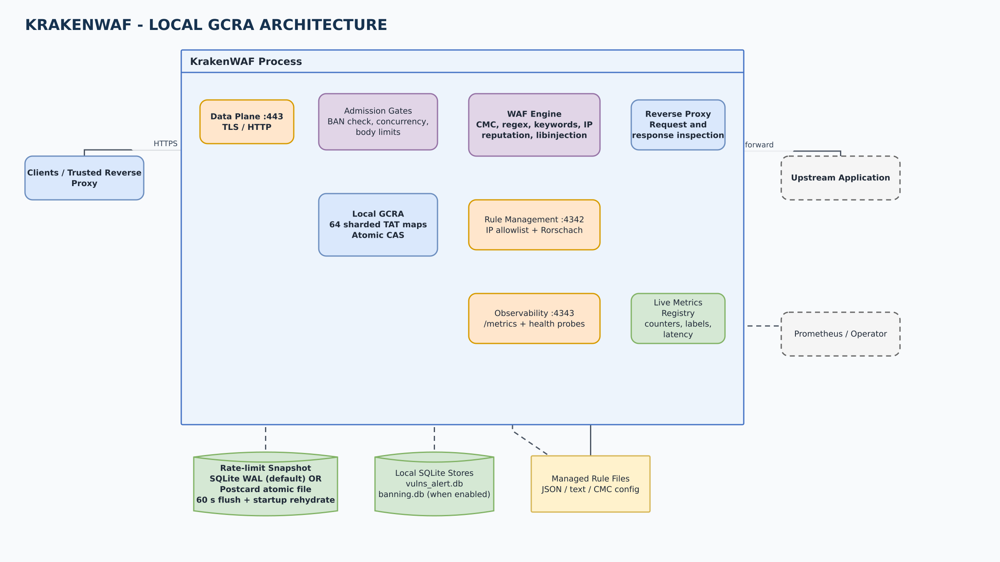
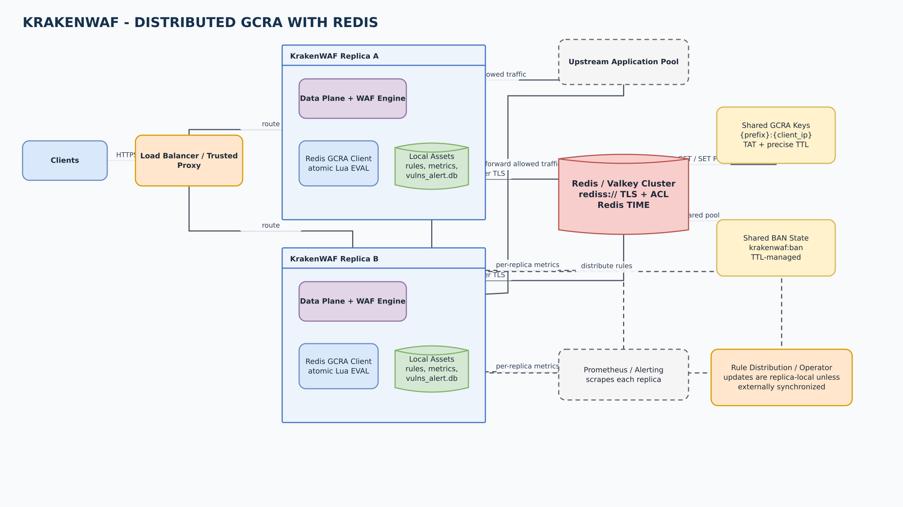
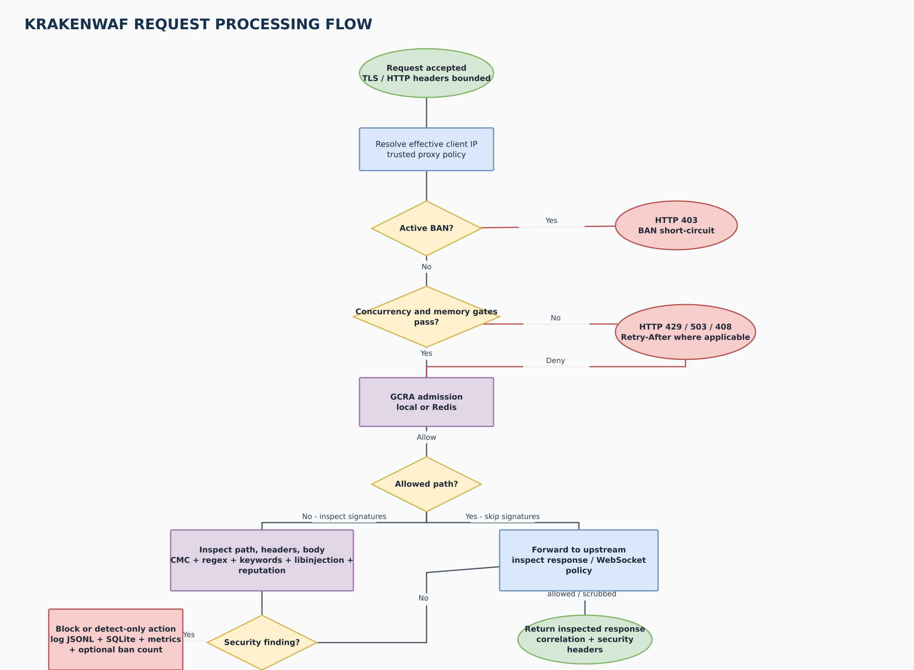
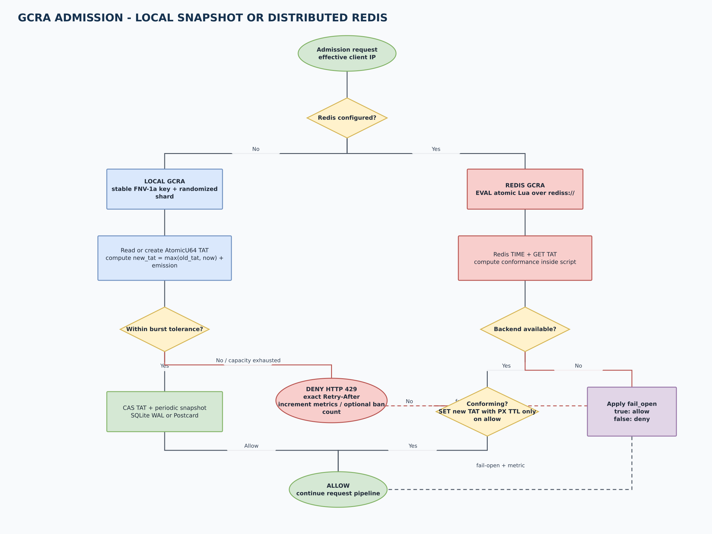
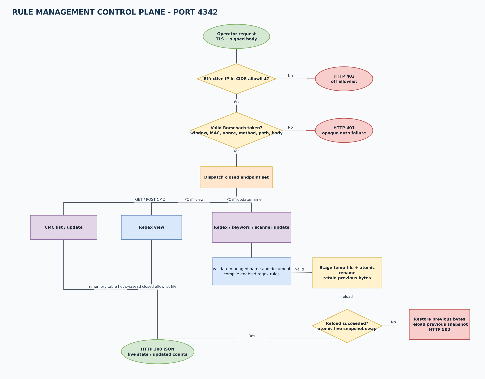
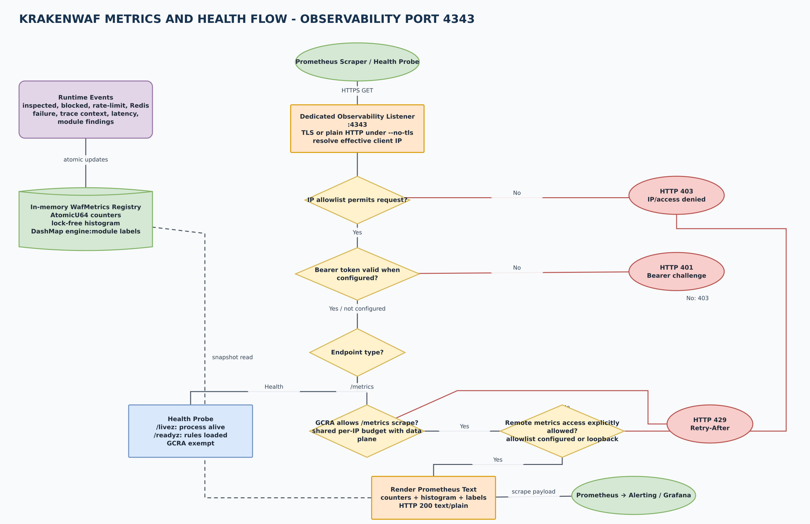

# KrakenWAF visual architecture

These diagrams describe the runtime architecture at commit `6497ad8` (v2.43.0).
All labels are in English and the source is editable in draw.io.

> The algorithm implemented by KrakenWAF is **GCRA** (Generic Cell Rate
> Algorithm). The occasionally used spelling "GRCA" refers to the same feature,
> but GCRA is the canonical term used by the code and this documentation.

## Diagram set

| View | Purpose | Preview | Editable source |
| --- | --- | --- | --- |
| Local architecture | Single-node deployment with local GCRA and SQLite WAL or Postcard snapshots | [PNG](diagrams/krakenwaf-local-architecture.png) | [draw.io](diagrams/krakenwaf-local-architecture.drawio) |
| Redis architecture | Multi-replica deployment with distributed GCRA and shared banning state | [PNG](diagrams/krakenwaf-redis-architecture.png) | [draw.io](diagrams/krakenwaf-redis-architecture.drawio) |
| Request processing | Data-plane admission, inspection, forwarding, and blocking flow | [PNG](diagrams/krakenwaf-request-flow.png) | [draw.io](diagrams/krakenwaf-request-flow.drawio) |
| GCRA admission | Local and Redis admission decisions, including backend failure policy | [PNG](diagrams/krakenwaf-gcra-flow.png) | [draw.io](diagrams/krakenwaf-gcra-flow.drawio) |
| Rule management | Allowlist and Rorschach gates, CMC updates, atomic rule replacement, and rollback | [PNG](diagrams/krakenwaf-rule-management-flow.png) | [draw.io](diagrams/krakenwaf-rule-management-flow.drawio) |
| Metrics and health | Runtime collection, observability access gates, GCRA, Prometheus rendering, and probe exemptions | [PNG](diagrams/krakenwaf-metrics-flow.png) | [draw.io](diagrams/krakenwaf-metrics-flow.drawio) |

## Local GCRA with SQLite or Postcard

The data plane resolves the effective client IP, checks the optional ban list,
enforces per-IP concurrency, and then applies GCRA before signature inspection.
The local limiter keeps TAT values in 64 in-process shards and persists a
snapshot every 60 seconds. `--wal-mode sqlite` writes an inspectable SQLite WAL
database; `--wal-mode postcard` writes an atomic-rename binary snapshot. These
formats persist only rate-limit state. Security findings always use
`logs/db/vulns_alert.db`, and local banning uses `logs/db/banning.db` when
enabled.

## Distributed GCRA with Redis

When `conf/ratelimit.yaml` contains `redis:`, every replica uses an atomic Lua
script and Redis `TIME` to share GCRA TAT state without application-host clock
skew. The same TLS connection pool is reused by the banning subsystem. Redis
does **not** replace the per-node vulnerability database, rule files, or metrics
registry. Rule-management updates are local to the replica receiving the
request; production clusters must distribute managed rule files consistently.

Redis transport must use `rediss://`. Credentials are resolved file-first and
then from environment variables. If Redis is unavailable, `redis.fail_open`
selects allow or deny behavior; both paths emit warnings and dedicated
Prometheus counters.

## Runtime flows

GCRA applies to all proxied requests before the allow-path decision. An
allow-listed path skips signature inspection but still consumes the shared
per-IP request budget. `/metrics` on the observability listener is also
rate-limited; health probes are exempt.

Both backends implement the same typed allow/deny contract and return an exact
retry delay. Local capacity exhaustion denies admission. Redis unavailability
uses the configured fail-open or fail-closed policy rather than silently
falling back to local state.

The control plane binds separately on port `4342` and is enabled only when both
Rorschach secrets are valid. The IP allowlist is checked before authentication.
CMC flags are hot-swapped in memory. Managed regex, keyword, and scanner files
are validated, staged, atomically renamed, and then reloaded into one live
engine snapshot; a reload failure restores the previous bytes and reloads them.

Runtime requests, blocks, rate-limit outcomes, trace propagation, latency, and
per-module findings update the in-memory metrics registry. On the dedicated
observability listener, IP restrictions run before bearer authentication.
`/metrics` then shares the data-plane GCRA budget and renders Prometheus text;
liveness and readiness probes are intentionally exempt from GCRA so orchestration
checks cannot be throttled.

## Operational surfaces

| Surface | Default | Protection | Main responsibility |
| --- | --- | --- | --- |
| Data plane | `:443` | TLS, trusted-proxy policy, WAF admission controls | Reverse proxy, request/response inspection, WebSocket policy |
| Rule management | `:4342` | CIDR allowlist, rotating body-bound Rorschach token | CMC toggles and managed rule-file replacement |
| Observability | `:4343` | IP allowlist and/or bearer token | Prometheus `/metrics`, liveness, readiness, health |

Prometheus output includes inspected and blocked totals, rate-limit hits,
per-engine/module block labels, request latency, trace-context counters, and
Redis fail-open/fail-closed counters. See [observability.md](observability.md),
[rate_limit.md](rate_limit.md), and [rule_management.md](rule_management.md) for
the full operational contracts.
